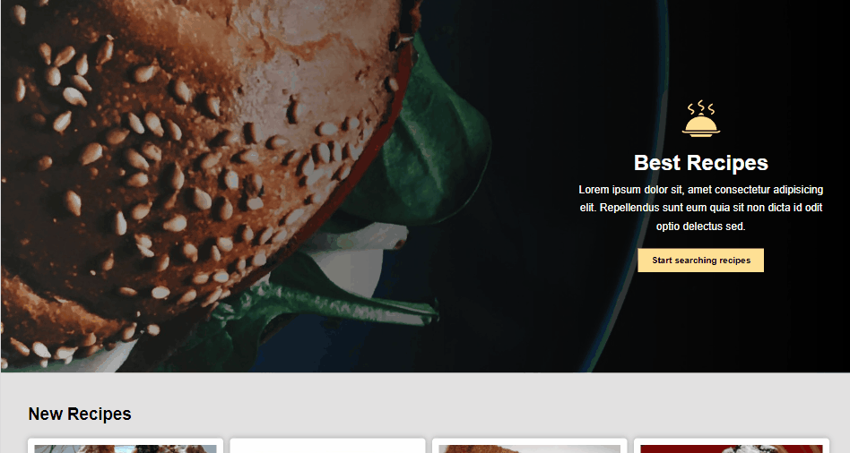

# R-Recipe

[https://r-recipe.onrender.com](https://r-recipe.onrender.com)

An recipe application built with React JS for the frontend and Express JS and Mongoose for the backend by using [spoonacular REST API](https://spoonacular.com/food-api).The user can search for recipe and filter the search based on certain values. The user can also see details about the recipe, such as recipe summary, ingredients, equipments, instructions and similar recipes. Additionally, after logging in, the user can add the favorite recipe to the her/his recipe list by clicking heart icon. I created a [REST API](https://github.com/Tanju67/React-Recipe-backend.git) for the backend of this application.

1. UserCredential:
   - email:test@mail.com
   - password:secret123

## Features

### Sign In & Sign Out

The user must log in to add the favorite recipe to the his/her recipe list.

### Search Recipe

Users can search recipe data by writing the name of the recipe and filter by cahnging cuisine, diet, type values.


### See Recipe Detail

Users can see the detail of recipes such as as recipe summary, ingredients, equipments, instructions and similar recipes. After logging in, the user can add the favorite recipe to the his/her recipe list by clicking heart icon.


## Built With

- React JS
- React Router
- CSS Modules

## Getting Started

### Prerequisites

Install npm.

- npm
  ```
  npm install npm@latest -g
  ```
- You must clone [the backend repo](https://github.com/Tanju67/React-Recipe-backend.git) of this application.
  ```
  git clone https://github.com/Tanju67/React-Recipe-backend.git
  ```

### Installation

1. Clone the repo.
   ```
   git clone https://github.com/Tanju67/React-Recipe-frontend.git
   ```
2. Install NPM packages.
   ```
   npm install
   ```
3. Create the backend url in a .env file.
   ```
   VITE_API_KEY = (your api key for spooncular REST API)
   VITE_INGREDIENT_URL=https://spoonacular.com/cdn/ingredients_100x100/
   VITE_EQUIPMENT_URL=https://spoonacular.com/cdn/equipment_100x100/
   VITE_BACKEND_URL=(your backend url)
   ```
4. Start the frontend server (Firstly you must start backend server).
   ```
   npm run dev
   ```
